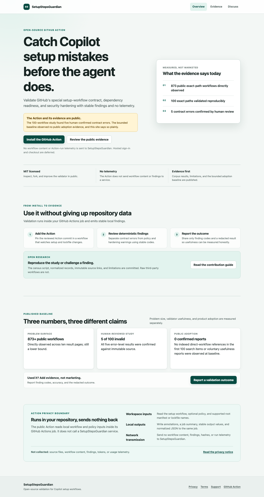

# SetupStepsGuardian

[](https://github.com/Chinmoy-Kulkarni/setup-steps-guardian/actions/workflows/ci.yml)
[](https://github.com/Chinmoy-Kulkarni/setup-steps-guardian/releases/latest)
[](LICENSE)

SetupStepsGuardian is an open-source, deterministic validator for
`.github/workflows/copilot-setup-steps.yml`.

> **Project status:** The GitHub Action is public and installable. The open-source validator,
> reproducible research scripts, corpus results, and adoption baseline are available now. The
> hosted dashboard and billing service are deferred until public demand exists.

[](https://chinmoy-kulkarni.github.io/setup-steps-guardian/)

It does not collect Action-run telemetry, send workflow content to a hosted service, or use an LLM.

## What it checks

- The required `copilot-setup-steps` job exists.
- The special workflow contains only the documented job.
- The setup job uses GitHub's documented keys and supported runner architectures.
- `timeout-minutes`, when present, is a positive integer within GitHub's limit.
- Node.js and Python runtime or dependency setup is reviewed against committed root lockfiles.
- Action pinning, secret usage, permissions, triggers, and runner allowlists follow the selected
  policy.
- Findings use stable codes and deterministic remediation. No LLM is involved.

SetupStepsGuardian validates the setup workflow. It does not claim that every coding-agent task
will succeed, and it does not replace code quality, security, or dependency scanning.

## Evidence, without inflated claims

The reproducible census directly observed **873 unique public exact-path workflows** across ten
GitHub result pages. A 100-workflow convenience sample found **5 human-confirmed contract errors**
and no fetch or execution failures. At the committed baseline, no public adoption evidence was
observed in the bounded GitHub metrics: zero stars, forks, subscribers, indexed direct-workflow
references among the first 100 search items, captured external participants, or confirmed outcomes.
Those measurements do not prove that adoption is zero.

Read the [evidence, methodology, human review, and limitations](docs/evidence.md). The project
separates ecosystem need, product adoption, and validator usefulness instead of treating them as
the same metric.

## Use the Action

```yaml
name: Validate Copilot setup

on:
  pull_request:
    paths:
      - ".github/workflows/copilot-setup-steps.yml"
      - ".github/agent-setup-policy.yml"
      - "package.json"
      - "pnpm-lock.yaml"

permissions:
  contents: read

jobs:
  validate:
    runs-on: ubuntu-latest
    steps:
      - uses: actions/checkout@d23441a48e516b6c34aea4fa41551a30e30af803
      - uses: Chinmoy-Kulkarni/setup-steps-guardian@0de8f30000634b8930a2eae1a1e7b8ae20b602dc
```

This is the reviewed commit behind `v1.0.0`. Keep the full SHA pin when enabling
SetupStepsGuardian in a production repository.

### Inputs

| Input | Default | Purpose |
| --- | --- | --- |
| `workflow-path` | `.github/workflows/copilot-setup-steps.yml` | Setup workflow to validate |
| `policy-path` | `.github/agent-setup-policy.yml` | Optional strict policy |
| `fail-on-warnings` | `false` | Treat warning findings as a failed Action |

### Outputs

`status`, `error-count`, `warning-count`, `workflow-hash`, `policy-hash`, and `result-json`
support downstream automation without parsing logs.

## Policy

```yaml
schemaVersion: 1
allowedRunners:
  - ubuntu-latest
# Prefix runner groups with "group:", for example group:organization-runners.
maxTimeoutMinutes: 30
requireTimeout: true
requireExplicitPermissions: true
requireWorkflowDispatch: true
actionPinning: warning
secretUsage: warning
unsupportedJobKeys: warning
```

See [the finding reference](docs/findings.md) for stable codes and remediation.
Release history is documented in [CHANGELOG.md](CHANGELOG.md).

## Report whether it helped

Use [Discussion #5](https://github.com/Chinmoy-Kulkarni/setup-steps-guardian/discussions/5) to
report finding codes, whether they were correct, and whether a change improved setup. Do not share
private source, logs, or secrets. Until reports exist, the project will continue to state that
user-confirmed usefulness is not yet proven.

## Development

```bash
pnpm install
pnpm check
pnpm build
```

The project is a TypeScript workspace containing a shared deterministic policy engine, a
GitHub Action, a Cloudflare Worker API, and a React dashboard.

See [CONTRIBUTING.md](CONTRIBUTING.md), [ROADMAP.md](ROADMAP.md), and
[GOVERNANCE.md](GOVERNANCE.md).

## Privacy model

The hosted service is designed to retain account, installation, repository, and installer-admin
numeric IDs plus hashes, normalized findings, workflow run metadata, and billing entitlement state
only. It must not retain raw source, workflow YAML, job logs, artifacts, GitHub access tokens,
webhook payloads, secrets, or payment-card data.

See [PRIVACY.md](PRIVACY.md), [SECURITY.md](SECURITY.md), and [SUPPORT.md](SUPPORT.md).
